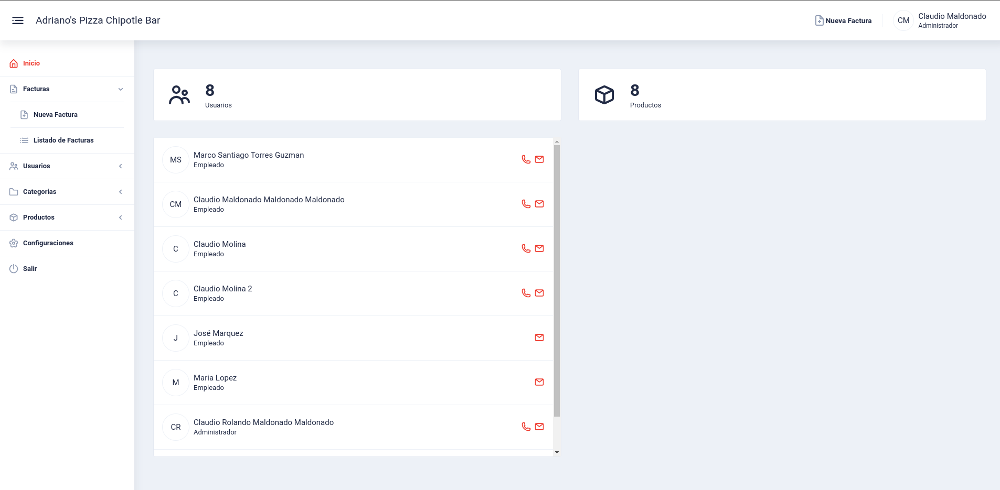

The chipotle bar web application was developed for a restaurant located in Chordeleg-Ecuador. The purpose of this application is to show customers the restaurant's products. On the part of the restaurant, the application allows you to manage employees, products, services, in addition to allowing you to make sales notes and have sales reports.

You can see it here: https://chipotlebar.com/

## technologies
* Angular
* Firebase
* Authentication
  * Firestore
  * Storage